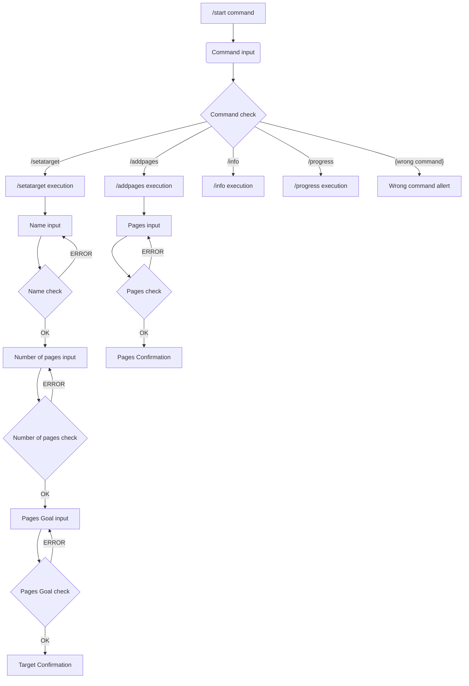

@https://t.me/phoenix_habit_bot
Трекер привычек:

Command Table:
First Header    | Second Header
-------------   | -------------
start           | Launch bot and start dialog
info            | Get information about bot possibilities 
setatarget      | Choose the goal you want to achieve
addpages        | Enter the number of pages read
progress        | See your stats for the month
donate          | Support bot team
----------------------------------------------------------------
Flow Chart

